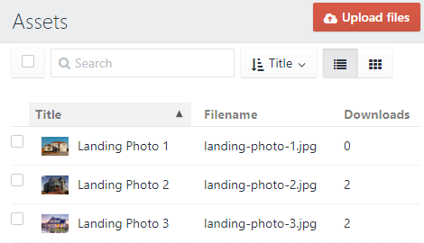

# Protected Links plugin for Craft CMS 4.x

This plugin is intended to provide a way for restricting access to asset files and hide their actual location. Additionally, it will count downloads for each file.



The access can be restricted to logged in users, or only certain user, or to member groups. The access can also be set to expire.

The plugin can also be used to hide actual file location.


## Requirements

This plugin requires Craft CMS 4.0.0 or later.

## Usage

The main (and currently only) template variable is `craft.protectedLinks.link`

Hide the file location without any restrictions:
```
{{ craft.protectedLinks.link({assetId: entry.downloads.first.id}) }}
```

Limit access to logged in users and display file inline in browser:
```
{{ craft.protectedLinks.link({assetId: 105, inline: true, requireLogin: true}) }}
```

Restrict file access to users in groups 1 and 7; allow access only when link is clicked on your site
```
{{ craft.protectedLinks.link({assetId: 105, memberGroups: [1,7], denyHotlink: true}) }}
```

Limit access to currently logged in user and display file inline in browser; make the link expire on 30th of April:
```
{{ craft.protectedLinks.link({assetId: 105, inline: true, members: craft.app.user.id, dateExpires: '2018-04-30'}) }}
```

Limit access to members with ID 1, 7 and 13; set the link to expire tomorrow:
```
{{ craft.protectedLinks.link({assetId: 105, members: [1,7,13], dateExpires: now|date_modify('+1 day')|date('Y-m-d')}) }}
```

Admin users can download files even if they are restricted to other user or group.

In addition to it's own checks, Protected Links also respects permissions set on Asset Volume in Craft.

### Parameters

| Parameter | Explanation |
| --------- | ----------- |
| assetId | Asset Id. Required |
| denyHotlink | Disallow hotlinking (only allow access if followed from your site) |
| requireLogin | Allow access to any logged in member |
| memberGroups | User groups allowed to access the file. Can be single ID or Twig array of IDs |
| members | Users allowed to access the file. Can be single ID or Twig array of IDs |
| inline | Display file inline in browser |
| mimeType | File mime type |
| dateExpires | Link expiration |

## Installation

To install the plugin, follow these instructions.

1. Open your terminal and go to your Craft project:

        cd /path/to/project

2. Then tell Composer to load the plugin:

        composer require intoeetive/protectedlinks

3. In the Control Panel, go to Settings → Plugins and click the “Install” button for Protected Links.

## Support

If you encounter any issues with the plugin, please post to GitHub issues.
